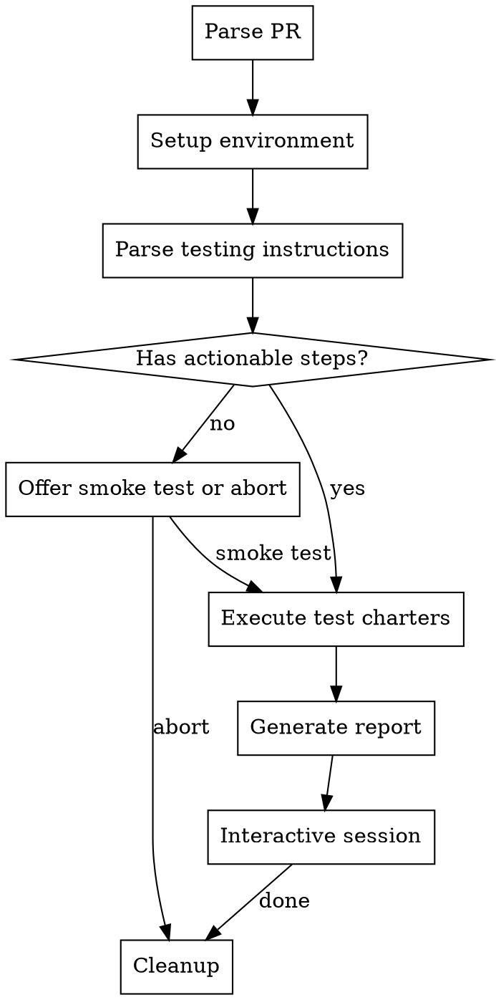
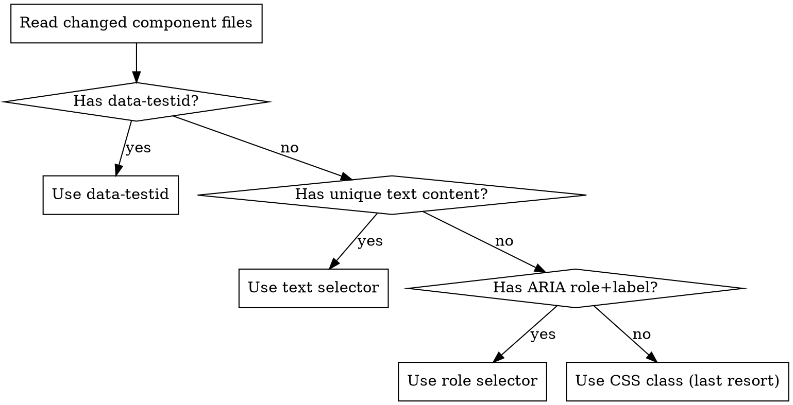

# Test PR

Automates manual PR testing in wp-calypso: fetch PR, checkout branch, start dev server, enable feature flags, execute testing instructions via Playwright, and report results.

## Workflow



## Phase 1: Parse PR

Extract PR number from input (direct number or GitHub URL).

```bash
gh pr view <number> --repo Automattic/wp-calypso --json title,body,headRefName,baseRefName,files,commits
```

From the response:
1. Extract **Testing Instructions** section (between `## Testing Instructions` and next `##` or end of body)
2. Detect **feature flags** using these patterns (in order):
   - `` enable.*`([a-z0-9-]+)`.*flag ``
   - `` gated by.*`([a-z0-9-]+)` ``
   - `` `([a-z0-9-]+)`.*feature flag ``
   - `ENABLE_FEATURES=([a-z0-9-,]+)`
   - Also scan changed source files for `config.isEnabled( 'flag-name' )` calls
3. Detect **which client** to start:
   - Check testing instructions for URL hints first (`my.localhost` -> Dashboard, `calypso.localhost` -> Calypso)
   - Cross-reference with changed file paths:

| File path prefix | Client | Command | URL |
|-----------------|--------|---------|-----|
| `client/dashboard/` | Dashboard | `yarn start-dashboard` | `http://my.localhost:3000` |
| `client/jetpack-cloud/` | Jetpack Cloud | `yarn start-jetpack-cloud` | `http://calypso.localhost:3000` |
| `client/a8c-for-agencies/` | A8C for Agencies | `yarn start-a8c-for-agencies` | `http://calypso.localhost:3000` |
| `packages/` or `apps/` only | Ambiguous | Prompt user | - |
| Mixed clients | Ambiguous | Prompt user | - |
| Default | Calypso | `yarn start` | `http://calypso.localhost:3000` |

4. If **no actionable testing instructions** found: inform user, offer smoke test (navigate to affected pages, check console errors) or abort.

## Phase 2: Setup Environment

### Step 1: Save state and checkout branch

```bash
# Save current branch for later restore
git branch --show-current

# Check for uncommitted changes
git status --porcelain
# If dirty: prompt user — stash, commit, or abort. Do NOT proceed with dirty state.

# Checkout PR branch (skip if already on it)
git fetch origin <pr-branch> && git checkout <pr-branch>
```

### Step 2: Install dependencies

Always run `yarn install` — it is a no-op when deps are current. Track that deps were installed so cleanup can restore them for the original branch.

### Step 3: Feature flags

Feature flags have two scopes:

| Scope | Mechanism | When to use |
|-------|-----------|-------------|
| **Build-time** | `ENABLE_FEATURES=flag1,flag2` env var | Starting a new dev server |
| **Runtime** | `?flags=flag1,flag2` URL query param | Reusing existing server (preferred — no restart) |
| **Runtime persistent** | `sessionStorage.setItem('flags', '...')` via `browser_evaluate` | Flags that must persist across navigations |

Preference order: (1) `ENABLE_FEATURES` when starting server, (2) `?flags=` query param when reusing server, (3) `sessionStorage` as last resort.

If flags can't be parsed cleanly: show what was detected, prompt user.

### Step 4: Dev server

```bash
# Check if port 3000 is in use
lsof -i :3000
```

Decision:
- **Nothing on port 3000** -> start the detected client server in background
- **Matching dev server already running** -> reuse it; use `?flags=` for feature flags instead of `ENABLE_FEATURES`
- **Wrong client or non-dev process on 3000** -> prompt user

Start command (example for Dashboard with flags):
```bash
ENABLE_FEATURES=mcp-settings yarn start-dashboard &
```

Poll until ready: HTTP 200 response with app root element present. **Timeout: 5 minutes**, poll every 10 seconds. Show progress to user during wait.

Track `server_started_by_skill` for cleanup.

### Step 5: Authentication

After server is ready, navigate to the first test URL. Check for login wall:
- URL redirected to `login.wordpress.com`
- Page contains login form (`#loginform`, `.login`, `input[name="log"]`)

If login required:
1. Tell user: "Login required. Please log in using the Playwright browser window, then say 'continue'."
2. Wait for user confirmation
3. Verify auth: navigate to test URL, confirm no redirect to login
4. If still not authenticated: prompt again

Once authenticated, Playwright's browser context preserves cookies for the session.

### Step 6: Discover Playwright tools

```
ToolSearch: "playwright navigate"
ToolSearch: "playwright snapshot"
ToolSearch: "playwright click"
ToolSearch: "playwright screenshot"
ToolSearch: "playwright evaluate"
ToolSearch: "playwright console"
```

Use whichever namespace is available (`mcp__playwright-test__*` or `mcp__plugin_playwright_playwright__*`).

## Phase 3: Parse Testing Instructions into Charters

This is the most critical phase — translating natural language testing instructions into structured, executable charters.

### Step 1: Classify each bullet

| Classification | Signal words | Action |
|---------------|-------------|--------|
| **Setup step** | "enable", "feature flag", "configure", "set up" | Already handled in Phase 2, skip |
| **Navigation step** | "navigate to", "go to", "open", "visit", URL paths | `browser_navigate` to URL |
| **Auto-verifiable** | "verify...appears", "verify...shows", "confirm", "should see", "no longer appear" | Playwright assertion |
| **Human-flagged** | "correct icon", "looks right", "proper styling", visual adjectives | Screenshot + flag for user |
| **Interactive** | "test adding", "test toggling", "click", "remove", "enable/disable" | Playwright action + verify state change |

### Step 2: Decompose compound instructions

A single bullet often contains multiple classifications. Break them apart:

> "Navigate to `/me/preferences` -- verify the 'AI and MCP' card appears with correct icon, description, and Enabled/Disabled badge."

Becomes:
1. **Navigation**: go to `/me/preferences`
2. **Auto-verify**: element with text "AI and MCP" exists on the page
3. **Auto-verify**: badge element with text "Enabled" or "Disabled" exists
4. **Auto-verify**: description text is non-empty
5. **Human-flag**: "correct icon" — take screenshot, flag for user

> "Verify Privacy and Blocked Sites no longer appear in the top-level account nav menu but do appear as cards on the Preferences page."

Becomes:
1. **Navigation**: go to the account nav menu (find the menu component in source)
2. **Auto-verify**: text "Privacy" does NOT appear in nav menu
3. **Auto-verify**: text "Blocked Sites" does NOT appear in nav menu
4. **Navigation**: go to `/me/preferences`
5. **Auto-verify**: "Privacy" card exists on the Preferences page
6. **Auto-verify**: "Blocked Sites" card exists on the Preferences page

> "Test adding a site (when account MCP is off) and confirm it appears in 'Enabled sites' with Manage/Remove."

Becomes:
1. **Auto-verify**: account MCP is currently off (check toggle state)
2. **Interactive**: click the site picker / add button
3. **Interactive**: select a site from the dropdown
4. **Auto-verify**: selected site now appears in "Enabled sites" list
5. **Auto-verify**: "Manage" action is visible for the added site
6. **Auto-verify**: "Remove" action is visible for the added site

### Step 3: Selector discovery

For each auto-verifiable and interactive step, find reliable selectors by reading the actual source code:



**Selector preference order:**
1. `data-testid` attributes (most stable)
2. Text content visible to user (e.g., `text="AI and MCP"`)
3. ARIA roles with labels (e.g., `role=button[name="Remove"]`)
4. CSS classes from the component source (least stable, last resort)

**How to find selectors in source:**
- Read the component files from the PR's changed files list
- Look for JSX elements: `<h2>`, `<Badge>`, `<Button>`, etc. with their props
- Note translation strings: `translate('AI and MCP')`, `__('Enabled')`
- Note link `to=` props for route verification
- Note component props like `icon={sparkles}`, `badge="Enabled"`

**Use `browser_snapshot`** (accessibility tree) as the primary verification method — it shows element roles, names, and states without needing CSS selectors. Only fall back to `browser_evaluate` with DOM queries when the accessibility tree doesn't expose what you need.

### Step 4: Generate charter summary

Before executing, present the parsed charters to the user:

```
Parsed N testing instructions into M executable steps:
- N auto-verifiable checks
- N interactive tests
- N items flagged for human review
- N setup steps (already handled)

Proceed with testing?
```

This gives the user a chance to catch misinterpretations before execution begins.

## Phase 4: Execute Test Charters

### Execution loop

For each step, follow this exact sequence:

1. **Navigate** to target URL (append `?flags=` if runtime flags needed)
2. **Wait** for page load — use `browser_wait_for` for a key element that signals the page is ready (not just network idle — SPAs may load content after initial render)
3. **Screenshot** before state — save to `screenshots/step-<N>-before.png`
4. **Verify or act** depending on step type:

**For auto-verifiable checks:**
- Run `browser_snapshot` to get the accessibility tree
- Search the tree for expected elements, text, roles, states
- For link verification: use `browser_evaluate` to check `href` attributes
- For toggle state: check `aria-checked` or `aria-pressed` in the snapshot
- For "does NOT appear" checks: confirm the element is absent from the snapshot
- Mark **PASS** with what was found, or **FAIL** with what was expected vs actual

**For human-flagged checks:**
- Take a focused screenshot (`browser_take_screenshot`)
- Report what WAS verified programmatically (e.g., "element exists, text matches")
- Explicitly flag what needs human eyes (e.g., "verify sparkles icon is correct — see screenshot")

**For interactive tests:**
- Screenshot "before" state
- Perform the action: `browser_click`, `browser_select_option`, `browser_type`
- Wait for the UI to update (use `browser_wait_for` or short delay)
- Screenshot "after" state — save to `screenshots/step-<N>-after.png`
- Run `browser_snapshot` again to verify the expected state change
- Check: did the element appear/disappear? Did the list update? Did the toggle flip?

5. **Console check** after every navigation and major interaction:
```
browser_console_messages
```
Flag any errors or warnings. Ignore known noise (e.g., React dev mode warnings, HMR messages). Real bugs often surface as console errors even when the UI looks fine.

6. **On failure:** mark FAIL, screenshot current state, log the error details, and **continue** to next step. Never abort the whole run on a single failure.

### Reporting each step to the user

After each step (or group of related steps for the same testing instruction), report:

```
Step N: <original instruction text>
  URL: /me/preferences
  ✓ "AI and MCP" card found (text match in accessibility tree)
  ✓ Badge text "Enabled" found
  ✗ NEEDS REVIEW: Icon appearance — screenshot saved (screenshots/step-3.png)
  Console: No errors
```

This gives the user real-time visibility into progress rather than waiting for the final report.

## Phase 5: Report

**Report directory:** `.hyper/notes/pr-test-reports/PR-<number>-YYYY-MM-DD/`

Create:
- `report.md` — full test report
- `screenshots/step-<N>.png` — viewport-sized screenshots

Report structure:
```markdown
# PR Test Report: #<number> - <title>

**Date:** YYYY-MM-DD
**Branch:** <branch>
**Client:** <client>
**Feature flags:** <flags> (<mechanism>)
**Base URL:** <url>

## Results Summary
| Status | Count |
|--------|-------|
| PASS (auto-verified) | N |
| FAIL | N |
| Needs human review | N |

## Detailed Results
### Step N: <instruction text>
- **URL:** <url>
- **Status:** PASS | FAIL | NEEDS REVIEW
- **Auto-verified:** <what was checked and result>
- **Human review:** <what needs eyes> (screenshot: screenshots/step-N.png)
- **Console errors:** <any errors>

## Needs Human Review
| Step | What to check | Screenshot |
|------|--------------|------------|

## Console Errors
<all JS errors captured>
```

## Phase 6: Interactive Session

Present summary, then accept commands:

| Command | Action |
|---------|--------|
| **"retest step N"** | Re-run specific step |
| **"dig into [area]"** | Exploratory testing around that area |
| **"post to PR"** | Post summary to PR (requires confirmation) |
| **"done"** | Save report, proceed to cleanup |

**PR comment format** (posted via `gh pr comment --repo Automattic/wp-calypso`):
```markdown
## Manual Test Results

| Status | Count |
|--------|-------|
| PASS | N |
| FAIL | N |
| Needs human review | N |

### Failures
- Step N: <what failed>

### Notes
<observations>

---
_Tested locally on `<branch>` with `<client>`. Full report with screenshots available locally._
```

Always confirm with user before posting.

## Phase 7: Cleanup

1. Stop dev server if `server_started_by_skill` (kill background process)
2. Checkout original branch: `git checkout <saved-branch>`
3. Run `yarn install` to restore deps for original branch
4. Confirm: "Cleaned up. Back on `<branch>`. Report saved to `<path>`."

## Worked Example: PR #109317

This shows exactly how the skill processes a real PR.

### Phase 1 output

```
PR: #109317 — Dashboard: implement AI + MCP settings design updates
Branch: add/ai-mcp-settings-design-updates
Feature flags detected: mcp-settings (from "Enable the `mcp-settings` feature flag")
Client detected: Dashboard (testing instructions mention "my.localhost:3000",
  12 of 19 changed files in client/dashboard/)
Command: ENABLE_FEATURES=mcp-settings yarn start-dashboard
Base URL: http://my.localhost:3000
```

### Phase 3 output — parsed charters

Testing instruction: *"Enable the `mcp-settings` feature flag locally"*
→ **Setup step** — handled via ENABLE_FEATURES env var. Skip.

Testing instruction: *"Review code from new hosting dashboard, i.e. http://my.localhost:3000/me/mcp"*
→ **Navigation**: go to /me/mcp
→ **Auto-verify**: page loads without error
→ **Human-flag**: visual review of the page layout

Testing instruction: *"Navigate to `/me/preferences` -- verify the 'AI and MCP' card appears with correct icon, description, and Enabled/Disabled badge."*
→ **Navigation**: go to /me/preferences
→ **Auto-verify**: element with text "AI and MCP" exists (read `preferences-ai-mcp/index.tsx` for component structure)
→ **Auto-verify**: badge with text "Enabled" or "Disabled" found
→ **Auto-verify**: link to /me/mcp present
→ **Human-flag**: icon appearance (screenshot)

Testing instruction: *"Verify Privacy and Blocked Sites no longer appear in the top-level account nav menu but do appear as cards on the Preferences page."*
→ **Navigation**: find account nav (read `me-menu/index.tsx` — note: this file has 10 lines deleted)
→ **Auto-verify**: "Privacy" NOT in nav menu
→ **Auto-verify**: "Blocked Sites" NOT in nav menu
→ **Navigation**: go to /me/preferences
→ **Auto-verify**: "Privacy" card exists
→ **Auto-verify**: "Blocked Sites" card exists

Testing instruction: *"Navigate to `/me/mcp` -- verify the `FormTokenField` is replaced by the `PreferencesLoginSiteDropdown`."*
→ **Navigation**: go to /me/mcp
→ **Auto-verify**: no FormTokenField present (check accessibility tree for token input)
→ **Auto-verify**: site dropdown with site icons/names present (read `mcp/index.tsx` for new component)
→ **Human-flag**: visual appearance of site picker

Testing instruction: *"Test adding a site (when account MCP is off) and confirm it appears in 'Enabled sites' with Manage/Remove."*
→ **Auto-verify**: check current MCP toggle state
→ **Interactive**: if MCP is on, toggle it off first
→ **Interactive**: click site picker, select a site
→ **Auto-verify**: site appears in "Enabled sites" section
→ **Auto-verify**: "Manage" action visible
→ **Auto-verify**: "Remove" action visible

Testing instruction: *"Test disabling a site (when account MCP is on) and confirm it appears in 'Disabled sites' with Remove."*
→ **Interactive**: toggle account MCP on (if not already)
→ **Interactive**: click to disable a specific site
→ **Auto-verify**: site appears in "Disabled sites" section
→ **Auto-verify**: "Remove" action visible

Testing instruction: *"Navigate to a site's AI tools settings page -- verify the MCP access toggle appears below the AI assistant card with a 'Manage at account level' link."*
→ **Navigation**: go to site AI tools settings (read `settings-ai-tools/index.tsx` for route)
→ **Auto-verify**: MCP access toggle exists (check for toggle/switch in accessibility tree)
→ **Auto-verify**: text "Manage at account level" exists
→ **Auto-verify**: "Manage at account level" is a link to /me/mcp
→ **Human-flag**: visual placement "below the AI assistant card"

### Phase 4 output — per-step reporting

```
Step 1: Navigate to /me/mcp and review page
  URL: http://my.localhost:3000/me/mcp
  ✓ Page loaded (HTTP 200, no redirect)
  ✓ No console errors
  ✗ NEEDS REVIEW: Overall page layout — screenshot saved (screenshots/step-1.png)

Step 2: Verify "AI and MCP" card on /me/preferences
  URL: http://my.localhost:3000/me/preferences
  ✓ "AI and MCP" text found in card heading
  ✓ Badge with text "Enabled" found
  ✓ Link to /me/mcp found (href="/me/mcp")
  ✗ NEEDS REVIEW: Sparkles icon appearance — screenshot saved (screenshots/step-2.png)
  Console: No errors

Step 3: Verify Privacy and Blocked Sites moved from nav to Preferences
  URL: http://my.localhost:3000/me
  ✓ "Privacy" NOT found in account nav menu
  ✓ "Blocked Sites" NOT found in account nav menu
  URL: http://my.localhost:3000/me/preferences
  ✓ "Privacy" card found on Preferences page
  ✓ "Blocked Sites" card found on Preferences page
  Console: No errors

...
```

## Common Mistakes

| Mistake | Fix |
|---------|-----|
| Starting server without feature flags | Use `ENABLE_FEATURES` env var at start time |
| Guessing CSS selectors | Read component source from changed files first |
| Aborting on first failure | Continue to next step, report all failures |
| Forgetting console error checks | Check after every navigation and interaction |
| Not restoring original branch | Always save branch at start, restore in cleanup |
| Posting to PR without confirmation | Always ask user before `gh pr comment` |
| Skipping charter summary before execution | Always present parsed charters and ask user to confirm before running |
| Not reading changed component source | Selectors, text strings, and route paths come from the actual code — read it |
| Testing only happy paths | Also verify negative cases ("no longer appears", "does NOT show") |
| Waiting for final report to show progress | Report each step result to user in real-time |
