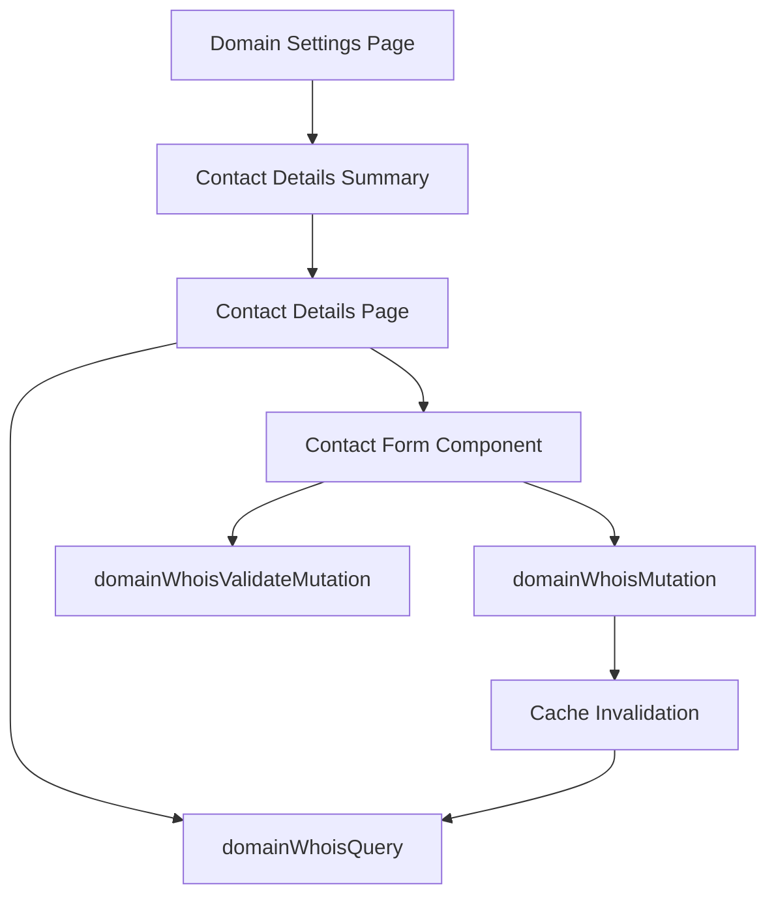

# Design Document

## Overview

This design document outlines the implementation of the "Contact details & privacy" feature for the WordPress.com Dashboard. The feature adds a new menu item to domain settings that allows users to view and edit their domain contact information, manage privacy settings, and handle transfer lock preferences.

The implementation follows the established dashboard patterns using TanStack Query for data management, WordPress components for UI consistency, and integrates seamlessly with the existing domain management infrastructure.

## Architecture

### Component Structure

The feature follows the established dashboard domain component patterns with minimal custom CSS:

```
client/dashboard/domains/
├── domain-contact-details/
│   ├── index.tsx                    # Main contact details page (uses VStack, Card layout)
│   ├── summary.tsx                  # Summary component for settings menu
│   ├── contact-form.tsx             # DataForm component with WordPress layout
│   └── privacy-status.tsx           # Privacy protection status display
└── domain-overview/
    └── settings.tsx                 # Updated to include contact details menu item
```

**Layout Strategy**:

- Use `VStack` for vertical component spacing
- Use `HStack` for horizontal button groups and inline elements
- Use `Card` and `CardBody` for content containers
- Use `SectionHeader` for consistent heading styles
- Leverage component spacing props instead of custom CSS

### Data Flow Architecture



## Components and Interfaces

### 1. Contact Details Summary Component

**File**: `client/dashboard/domains/domain-contact-details/summary.tsx`

**Purpose**: Displays the contact details menu item in the domain settings list

**Props Interface**:

```typescript
interface ContactDetailsSummaryProps {
	domain: Domain;
	isDisabled?: boolean;
}
```

**Functionality**:

- Shows current privacy protection status
- Displays "Privacy protection on" or "Privacy protection off" status
- Links to the detailed contact information page
- Follows the same pattern as other summary components (DNS, Security, etc.)

### 2. Contact Details Main Page

**File**: `client/dashboard/domains/domain-contact-details/index.tsx`

**Purpose**: Main page for viewing and editing contact information

**Key Features**:

- Uses `useSuspenseQuery` with `domainWhoisQuery` to load contact data
- Displays contact information in a structured layout
- Provides edit functionality through the contact form component
- Handles loading states and error conditions

### 3. Contact DataForm Component

**File**: `client/dashboard/domains/domain-contact-details/contact-form.tsx`

**Purpose**: DataForm-based component for displaying and editing domain contact information using WordPress core DataForm

**Props Interface**:

```typescript
interface ContactFormProps {
	domain: Domain;
	initialData: DomainContactDetails;
	onSave: ( data: DomainContactDetails, transferLock: boolean ) => void;
	onCancel: () => void;
	isSubmitting: boolean;
	isEditing: boolean;
}
```

**DataForm Configuration**:

Uses WordPress core `DataForm` component with field configuration for:

- First Name (required, text field)
- Last Name (required, text field)
- Organization (optional, text field)
- Email (required, email field with validation)
- Country Code (select field with country options)
- Phone Number (text field with country-specific formatting)
- Country (required, select field)
- Address (required, textarea field)
- Address Line 2 (optional, text field)
- City (required, text field)
- State/Province (select field, country-dependent options)
- Postal Code (required, text field with country-specific validation)
- Transfer Lock Opt-out (checkbox field with help text)

**DataForm Benefits**:

- Consistent form rendering for both view and edit modes
- Built-in validation and error handling
- Accessibility compliance out of the box
- Responsive design and consistent styling
- Email (required)
- Country Code (dropdown)
- Phone Number
- Country (required, dropdown)
- Address (required)
- Address Line 2 (optional)
- City (required)
- State/Province (dropdown, country-dependent)
- Postal Code (required)
- Transfer Lock Opt-out (checkbox)

### 4. Privacy Status Component

**File**: `client/dashboard/domains/domain-contact-details/privacy-status.tsx`

**Purpose**: Displays current privacy protection status

**Props Interface**:

```typescript
interface PrivacyStatusProps {
	domain: Domain;
	privacyEnabled: boolean;
}
```

## Data Models

### Contact Details Data Structure

The component uses the existing `DomainContactDetails` type from `@automattic/api-core`:

```typescript
type DomainContactDetails = {
	firstName?: string;
	lastName?: string;
	organization?: string;
	email?: string;
	phone?: string;
	address1?: string;
	address2?: string;
	city?: string;
	state?: string;
	postalCode?: string;
	countryCode?: string;
	fax?: string;
	vatId?: string;
	optOutTransferLock: boolean;
	extra?: DomainContactDetailsExtra;
};
```

### Form Validation Schema

```typescript
interface ContactFormValidation {
	firstName: { required: true; minLength: 1 };
	lastName: { required: true; minLength: 1 };
	email: { required: true; pattern: EMAIL_REGEX };
	country: { required: true };
	address1: { required: true; minLength: 1 };
	city: { required: true; minLength: 1 };
	postalCode: { required: true; minLength: 1 };
	phone: { pattern: PHONE_REGEX };
}
```

## Correctness Properties

_A property is a characteristic or behavior that should hold true across all valid executions of a system-essentially, a formal statement about what the system should do. Properties serve as the bridge between human-readable specifications and machine-verifiable correctness guarantees._

### Property-Based Testing Properties

Based on the prework analysis, the following properties ensure the correctness of the contact details feature:

**Property 1: Contact information display completeness**
_For any_ domain with contact information, when the contact details page is loaded, all available contact fields should be displayed in the interface
**Validates: Requirements 2.1, 2.2**

**Property 2: Privacy status indication accuracy**
_For any_ domain, the privacy protection status displayed in the menu item should accurately reflect the domain's actual privacy settings
**Validates: Requirements 1.3**

**Property 3: Form validation completeness**
_For any_ contact form submission, all required fields (firstName, lastName, email, country, address1, city, postalCode) must be validated, and submission should be prevented if any required field is invalid
**Validates: Requirements 3.2, 4.4, 4.5**

**Property 4: Email validation accuracy**
_For any_ email address entered in the contact form, the validation should correctly identify valid and invalid email formats according to standard email format rules
**Validates: Requirements 4.1**

**Property 5: Phone number validation and formatting**
_For any_ phone number entered with a selected country code, the system should validate the format according to that country's phone number standards and format the display appropriately
**Validates: Requirements 4.2, 4.7**

**Property 6: Address validation by country**
_For any_ selected country, the address validation should enforce the appropriate required address components for that country's addressing system
**Validates: Requirements 4.3**

**Property 7: Country-dependent state dropdown behavior**
_For any_ country selection, state/province dropdowns should appear if and only if that country has defined states/provinces in the system
**Validates: Requirements 4.6**

**Property 8: Contact information save round-trip**
_For any_ valid contact information submitted through the form, the data saved to the API should match the `DomainContactDetails` type structure and include the transfer lock setting
**Validates: Requirements 3.3, 8.2, 8.4, 8.6**

**Property 9: Transfer lock setting persistence**
_For any_ transfer lock setting change, the saved value should accurately reflect the user's checkbox selection (opt-out checkbox unchecked = transfer lock enabled)
**Validates: Requirements 6.4**

**Property 10: Validation error specificity**
_For any_ form submission with validation errors, each invalid field should display a specific error message that clearly identifies the validation issue
**Validates: Requirements 3.4**

## Error Handling

### Error States and Recovery

**API Error Handling**:

- Network failures during data loading show retry options
- Validation errors from the server are mapped to specific form fields
- Save failures display clear error messages with retry functionality
- Timeout errors provide appropriate user feedback

**Form Error Handling**:

- Client-side validation prevents invalid submissions
- Server-side validation errors are displayed inline with form fields
- Required field validation is enforced before form submission
- Invalid data formats are caught and explained to users

**Loading State Management**:

- Contact information loading shows skeleton placeholders
- Form submission shows loading indicators and disables controls
- Long-running operations provide progress feedback
- Failed operations allow users to retry or cancel

## Testing Strategy

### Unit Testing Approach

**Component Testing**:

- Test individual components in isolation using React Testing Library
- Mock API calls and test component behavior with different data states
- Verify form validation logic and error handling
- Test user interactions like form submission and navigation

**Integration Testing**:

- Test component integration with TanStack Query
- Verify API call patterns and data flow
- Test error boundary behavior and recovery
- Validate routing and navigation between components

### Property-Based Testing Implementation

**Testing Framework**: Use `fast-check` for property-based testing in TypeScript

**Property Test Configuration**:

- Minimum 100 iterations per property test
- Each property test references its design document property
- Tag format: **Feature: contact-details-privacy, Property {number}: {property_text}**

**Test Data Generation**:

- Generate valid and invalid contact information using realistic constraints
- Create country-specific address and phone number generators
- Generate edge cases for form validation testing
- Use domain-specific generators for email and postal code formats

**Example Property Test Structure**:

```typescript
// Feature: contact-details-privacy, Property 4: Email validation accuracy
test( 'email validation property', () => {
	fc.assert(
		fc.property(
			fc.emailAddress(),
			fc.string().filter( ( s ) => ! isValidEmail( s ) ),
			( validEmail, invalidEmail ) => {
				expect( validateEmail( validEmail ) ).toBe( true );
				expect( validateEmail( invalidEmail ) ).toBe( false );
			}
		),
		{ numRuns: 100 }
	);
} );
```

### Manual Testing Guidelines

**User Acceptance Testing**:

- Test complete user workflows from domain settings to contact information updates
- Verify visual design consistency with existing dashboard components
- Test responsive behavior across different screen sizes
- Validate accessibility features with screen readers and keyboard navigation

**Cross-browser Testing**:

- Test form functionality across supported browsers
- Verify API integration works consistently
- Test responsive design on different devices
- Validate accessibility compliance

**Performance Testing**:

- Measure form rendering performance with large datasets
- Test API response times and caching behavior
- Verify smooth user interactions without blocking
- Monitor memory usage during extended form sessions

## Implementation Notes

### WordPress Component Integration

**DataForm Component Usage**:

- Use WordPress core `DataForm` component as the primary interface for contact information
- Configure DataForm fields for both display and edit modes
- Leverage DataForm's built-in validation, accessibility, and responsive design
- Use DataForm's field configuration API for dynamic form behavior (country-dependent states)

**Additional Component Selection**:

- Use `@wordpress/components` for supplementary UI elements (buttons, notices, modals)
- Leverage existing dashboard components for consistent styling and layout
- Follow WordPress accessibility guidelines throughout the interface
- Use WordPress design system tokens for spacing, colors, and typography
- Import and use `__` from `@wordpress/i18n` for all user-facing text and labels

**DataForm Field Configuration**:

```typescript
import { __ } from '@wordpress/i18n';

const contactFormFields = [
	{
		id: 'firstName',
		label: __( 'First name' ),
		type: 'text',
		validation: { required: true },
	},
	{
		id: 'lastName',
		label: __( 'Last name' ),
		type: 'text',
		validation: { required: true },
	},
	{
		id: 'organization',
		label: __( 'Organization' ),
		type: 'text',
		validation: { required: false },
	},
	{
		id: 'email',
		label: __( 'Email' ),
		type: 'email',
		validation: { required: true, pattern: EMAIL_REGEX },
	},
	{
		id: 'countryCode',
		label: __( 'Country code' ),
		type: 'select',
		options: countryCodeOptions,
	},
	{
		id: 'phone',
		label: __( 'Phone number' ),
		type: 'text',
		validation: { pattern: PHONE_REGEX },
	},
	{
		id: 'country',
		label: __( 'Country' ),
		type: 'select',
		validation: { required: true },
		options: countryOptions,
	},
	{
		id: 'address1',
		label: __( 'Address' ),
		type: 'textarea',
		validation: { required: true },
	},
	{
		id: 'address2',
		label: __( 'Address line 2' ),
		type: 'text',
		validation: { required: false },
	},
	{
		id: 'city',
		label: __( 'City' ),
		type: 'text',
		validation: { required: true },
	},
	{
		id: 'state',
		label: __( 'State' ),
		type: 'select',
		options: stateOptions, // Dynamic based on country
		validation: { required: false },
	},
	{
		id: 'postalCode',
		label: __( 'Postal code' ),
		type: 'text',
		validation: { required: true },
	},
	{
		id: 'optOutTransferLock',
		label: __( 'Opt-out of the 60-day transfer lock' ),
		type: 'checkbox',
		help: __( 'What is this?' ), // Link to help documentation
	},
];
```

**Styling Approach**:

- **Layout Components**: Use WordPress layout components (`VStack`, `HStack`, `Card`, `CardBody`) for all layout needs
- **Minimal Custom CSS**: Avoid custom CSS by leveraging WordPress component spacing and layout props
- **Component-based Layout**: Use `VStack` for vertical spacing, `HStack` for horizontal alignment
- **WordPress Design Tokens**: Rely on component props for spacing (e.g., `spacing={ 4 }`) rather than custom CSS
- **Responsive Design**: Use WordPress component responsive behavior instead of custom breakpoints

**Layout Pattern Example**:

```typescript
import {
  __experimentalVStack as VStack,
  __experimentalHStack as HStack,
  Card,
  CardBody
} from '@wordpress/components';

// Main layout structure
<Card>
  <CardBody>
    <VStack spacing={ 4 }>
      <SectionHeader title={ __( 'Contact details & privacy' ) } level={ 3 } />
      <DataForm fields={ contactFormFields } />
      <HStack justify="flex-start">
        <Button variant="primary">{ __( 'Save' ) }</Button>
        <Button variant="secondary">{ __( 'Cancel' ) }</Button>
      </HStack>
    </VStack>
  </CardBody>
</Card>
```

### TanStack Query Integration

**Query Configuration**:

- Use `useSuspenseQuery` for contact data loading to handle loading states automatically
- Configure appropriate stale times and cache invalidation
- Implement optimistic updates for better user experience
- Handle query errors with proper fallback UI

**Mutation Handling**:

- Use mutation callbacks on the `mutate()` call for component-specific handling
- Implement proper error handling and user feedback
- Ensure cache invalidation after successful mutations
- Handle concurrent mutations appropriately

### Routing Integration

**URL Structure**:

- Follow existing domain management URL patterns
- Implement proper breadcrumb navigation
- Handle deep linking to contact details pages
- Maintain browser history for proper back/forward behavior

**Navigation Flow**:

- Integrate with existing domain menu navigation
- Provide clear paths back to domain overview
- Handle unsaved changes with appropriate warnings
- Support keyboard navigation throughout the interface
