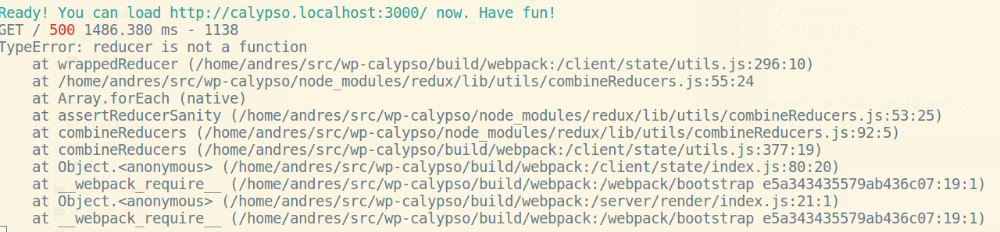

# Why these reducers were extracted from the root reducer

The reason is that, at the moment, we only support one export for the root reducer of the extension. If we introduce a default export that uses `state/util/combineReducers` and several named ones, we'll get a run-time error such as:

Another approach could be to extract them to one folder per reducer named after it. That's what we do when they contain nested reducers. But because these aren't nested, that approach would miscommunicate the reason why they were extracted.
