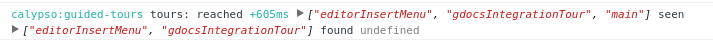

# Tips on debugging Guided Tours

## My tour is not shown more than once

After a tour is shown, it is recorded in the user's [guided tours history](https://github.com/Automattic/wp-calypso/blob/98fefd12e7ed9c3865400b2ab5e3adb417961d25/client/state/preferences/schema.js#L28-L40) and it will not be shown again. To determine if that's the case:

- Enable the debug info for Guided Tours: `localStorage.setItem( 'debug', 'calypso:guided*' )`.
- Guided Tours calculates `eligibleTours = reachedTours - seenTours`, so if your tour is in the `seen` array, then you have to reset the history.

In the following example, the tours `gdocsIntegrationTour` and `editorInsertMenu` were already seen by the user, so they won't be shown again.

Currently, there is no systematic way of clearing a user's history for debugging. One way you can clear it is by applying the [`clean-history.patch`](./patch/clean-history.patch) to your working tree.

To do this, run `git apply client/layout/guided-tours/docs/patch/clean-history.patch` from the application root directory.

Reload the page to clean the history, then remove the patch again.

## My tour is only shown when called via the query arg

If your tour is only shown when it is called via the query arg (`?tour=<TOURNAME>`), there are two places to check:

- [Are the user preferences missing](https://github.com/Automattic/wp-calypso/pull/10822)? The Guided Tours debug output should include a line like _No fresh user preferences, bailing._ A typical scenario you may run into is that your 2FA token is stale: visit the `/me` section and either disable the 2FA or introduce a valid code.
- Does your tour specify a path via `<Tour path="/path">`? If so, is the path reached? The tour should be included in the debugging output for `reachedTours` if the path is indeed reached (see previous section).
- The triggers for your tour, meaning the `when` function in `<Tour name=… when=…>`.
- Any step-specific conditions? Check your steps for `when` functions too.
