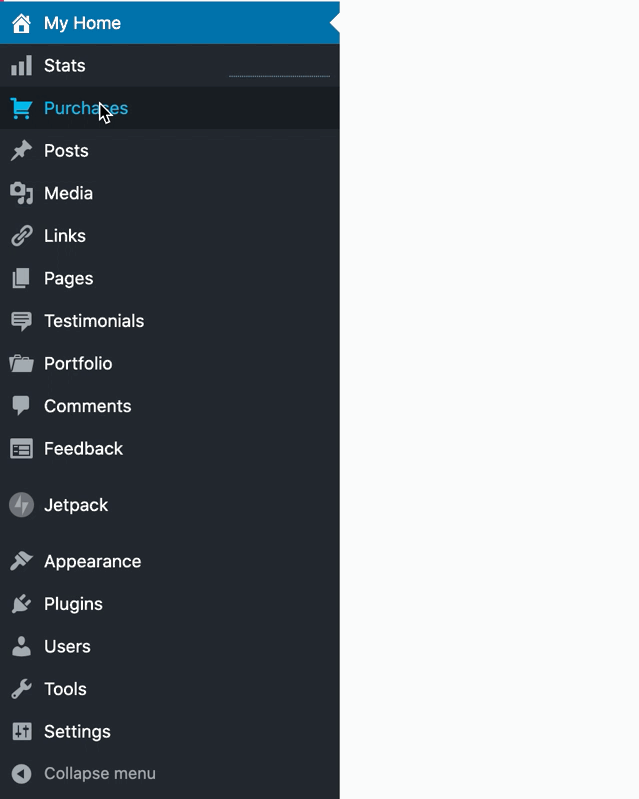

# Hoverintent

HoverIntent is a wrapper component that attempts to determine the user's intent of hovering over the child element in which case returns the `onMouseOver` event or `onMouseOut` if `onMouseOver` was previously triggered. The most common scenarios:

1. Having a button that triggers a popover (example below). In that case, when user hovers their mouse fast over the element but doesn't stop over the element then `onMouseOver` will not be triggered.

2. Evaluating the users intention to move the cursor to a flyout submenu.



## Props

`onMouseOver` : The callback to fire on mouse over event

`onMouseOut` : The callback to fire on mouse out event

`timeout` :
A simple delay, in milliseconds, before the `onMouseOut` callback is fired. If the user mouses back over the element before the timeout has expired the `onMouseOut` callback will not be called (nor will the `onMouseOver` callback be called). This is primarily to protect against sloppy/human mousing trajectories that temporarily (and unintentionally) take the user off of the target element... giving them time to return.

Default `timeout: 0`

`sensitivity` :
If the mouse travels fewer than this number of pixels between polling intervals, then the `onMouseOver` callback will be called. With the minimum sensitivity threshold of 1, the mouse must not move between polling intervals. With higher sensitivity thresholds you are more likely to receive a false positive.

Default `sensitivity: 7`

`interval` :
The number of milliseconds hoverIntent waits between reading/comparing mouse coordinates. When the user's mouse first enters the element its coordinates are recorded. The soonest the `onMouseOut` callback can be called is after a single polling interval. Setting the polling interval higher will increase the delay before the first possible `onMouseOver` call, but also increases the time to the next point of comparison.

Default `interval: 700`

## Example

```javascript
import HoverIntent from 'calypso/lib/hover-intent';
import classnames from 'classnames';

class App extends Component {
	constructor() {
		super();
		this.state = { mouseover: false };
	}
	onMouseOver = () => {
		this.setState( { mouseover: true } );
	};
	onMouseOut = () => {
		this.setState( { mouseover: false } );
	};
	render() {
		const { mouseover } = this.state;
		return (
			<div className="container">
				<HoverIntent
					onMouseOver={ this.onMouseOver }
					onMouseOut={ this.onMouseOut }
					sensitivity={ 10 }
					interval={ 1000 }
					timeout={ 250 }
				>
					<button>Hover</button>
				</HoverIntent>
				<span className={ classnames( 'popover', { open: mouseover } ) }>Hover</span>
			</div>
		);
	}
}
```
