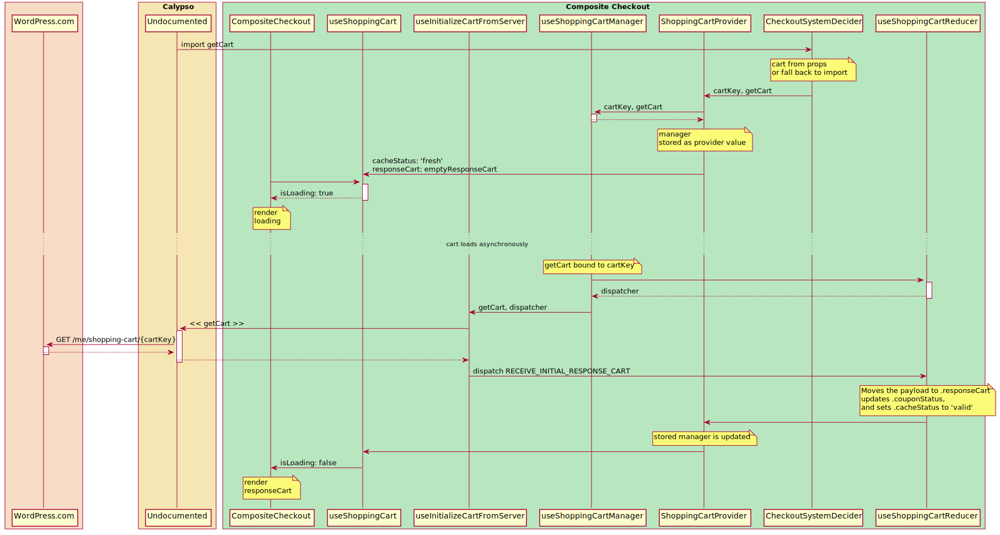

# Checkout

This module centralizes the views and controllers that belong to _Checkout_ under the _My Sites_ section of Calypso. The routing logic is located in `index.js`.

This module supports a variety of routes that are described in each submodule.

## Initializing checkout flow

To start a plan checkout flow, use appropriate URLS:

- <https://wordpress.com/checkout/site.wordpress.com/premium>
- <https://wordpress.com/checkout/site.wordpress.com/personal>
- <https://wordpress.com/checkout/site.wordpress.com/business>
- <https://wordpress.com/checkout/site.jetpack.me/premium>
- <https://wordpress.com/checkout/site.jetpack.me/professional>

Plan routes are sourced from `lib/plans/constants.js`

## Diagrams

A significant amount of the shopping cart workflow takes place through hooks in [@automattic/composite-checkout](../../../packages/composite-checkout/).

These diagrams show how the WordPress APIs are connected to these workflows as well as the important interactions.

### Get Cart

### Save Cart

