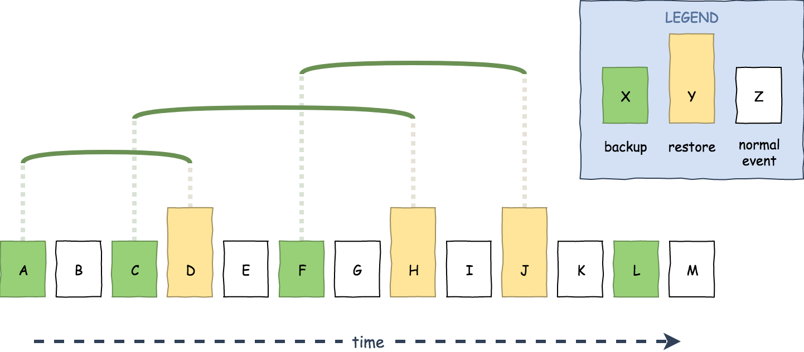

# Activity Log Discarderer

Events in the Activity Log have a general notion of being _discarded_ or not.
Events, or activities, never truly disappear from a site.
However, in the course of restoring backups we can get into a state where
it appears as though specific events had never taken place because of
how the rewind zipped past it.
We say that these events are (temporarily) **discarded** when this happens.


<!-- diagram generated in draw.io with `discarded-events.xml` -->

Actually knowing whether or not an activity has been discarded however can be
difficult to ascertain; it depends on the perspective from which we analyze
the stream of events and it's inherently a recursive problem.

> A discarded event is an event which is hidden by a restore operation which
> itself is not also discarded from the perspective from which we are looking.

This module exists to take an existing list of activity log events and augment
that list with an accurate value for `isDiscarded` based on the combination of
rewind/restore timestamp pairs (the restore event itself and the backup event
which it is restoring) and the timestamp of our point of observation.


## Usage

The simplest way to use this is to pass in a list of activity log events to the
built in helper method, `rewriteStream`.

```js
const log = rewriteStream( getActivityLogs( … ), getRewindEvents( … ) )
```

Of course, this _is_ just a helper around the two more fundamental bits: one
which extracts the restore events from the list and one which uses that
information to calculate the `isDiscarded` property.

```js
const events = getActivityLogs( … )
const rewinds = getRewinds( events )
const isDiscarded = makeIsDiscarded( rewinds, Date.now() )
const log = events.map( e => ( { ...e, activityIsDiscarded: isDiscarded( e.activityTs ) } ) )
```

If we wanted to re-examine from a mid-stream perspective we can do that too.
We just have to pass in the timestamp from the mid-stream event which we will
use as our point of observation.

```js
const log = rewriteStream( getActivityLogs( … ), getRewindEvents( … ), selectedEvent.activityTs )
```

Obviously every event newer than the mid-stream event will be discarded because
when we examine the activity log from the perspective of the time that our
selected event occurred, none of the newer activity had yet occurred.

## Theory of operation

In order for this algorithm to work we need to know all restore operation timestamps
and their associated backup event timestamps from the oldest event under examination
until the point in time form which we are calculating `isDiscarded`. In most cases
this will be "now," meaning we need all rewind operations from the oldest event we
have until the very latest point in time.

It's not too difficult of an algorithm and can be inferred from its definition:

> A discarded event is an event which is hidden by a restore operation which
> itself is not also discarded from the perspective from which we are looking.

We thus need to find for any given event timestamp all of the restore operations
which would cover that event in time. Once we have that list, we start trying to
eliminate those covering restores by checking if they themselves are discarded;
this is the recursive part. We will end up recursing for every level of overlapping
restore operations. If we have any remaining covering restores at the end then we
know the event should be considered discarded.

This algorithm by itself does't scale, especially with many restore operations.
However, like many recursive operations, basic memoization can take it from
practically unusable to sufficiently fast.

Basic testing has revealed that this should perform well on any recent computer
within a single render-frame given event streams with a thousand events or fewer.

### Example

In the diagram at the top we can examine event D, which itself is a restore operation
restoring event A. Should event D be considered discarded from the perspective of our
most-recent event, event M?

  1. Find all covering restores: D is only covered by [ H restoring C ]
  2. Eliminate discarded restores:

      1. For event H, find covering restores: H is covered by [ J restoring F ]
      2. Eliminate discarded restores: No more restores are covered
      3. Restore event H is _discarded_ by J

  3. Since no restore events are left covering D, D _is not discarded_.
