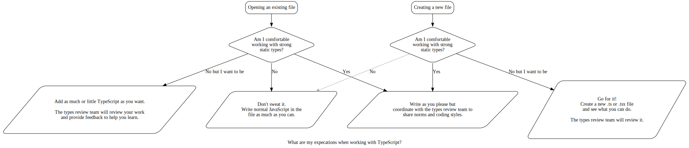

TypeScript Coding Guidelines
============================

Although TypeScript exists inside of the Calypso repository you don't currently need to feel obligated to use it.
We have brought it in for added safety and automation while developing our software and thus an operating principle
is that the type system is supposed to serve you; if you feel like you are serving the type system then consider
stepping back to normal JavaScript or raise a discussion in Slack.

## Should I be using TypeScript?

Try to follow this flow-chart to see if you should be using TypeScript in your work.

If you have come here to ask this question then you should feel comfortable continuing to use JavaScript
as you have been doing and you don't need to change your workflow.

If you are jumping into a file that is already written in TypeScript then it gets slightly more complicated
because you might be working in code that is unfamiliar to you. Try your best to work within that code but
don't feel compelled to match its use of types and type annotations. We have created the `@Automattic/type-review`
team in Calypso to monitor and review all work being done in TypeScript files as we grow together to establish
norms and learn proper patterns and idioms; this team is there to help guide you in the unfamiliar territory. 



Graph built with [`typescript-dev-flow.dot`](./typescript-dev-flow.dot)

## Type Principles for Calypso

 - TypeScript has a modern type system unlike those from the C language or Java. It's _permissive_ in the sense
   that we can add types to part of a file without typing the entire file and in the sense that it's _structural_
   instead of _nominative_ meaning that it tries to unify type constraints whether they are specified as a `Person`
   or as "an object containing a `string` property called `name`." We will allow its design to inform our use patterns.
 - _Type only what is helpful_: TypeScript's inference engine is powerful and can usually infer type information
   from untyped JavaScript. Encode only as much in the annotation as is necessary to clear up ambiguities in the
   inferred types and also to communicate to other developers.
 - _Types communicate intent_ to other developers (and yourself): Consider the statements that your types make
   and prefer specific and meaningful types when things are otherwise ambiguous. Give tolerance to weaker typings
   when code is already clear. Remember to look at the types of what you write in your IDE to get an impression of
   how the annotations are communicating the types and adjust if necessary. In addition to knowing just the
   fundamental data types that a function expects, our types shoud communicate the purpose of the values we're sending.
 - We are _gradually_ typing code in Calypso where it's most helpful. Don't worry about fixing all the warnings and
   errors and typing everything in a module. Consider the effort involved, the complexity of the type signatures
   relative to the experience shared globally around the project, and the payoff for adding those types.

## Getting started with TypeScript

If you see something you don't understand then try not to let it cause more trouble than it needs to.
Reach out and ask for help if you are working in existing code.

If you want to be writing TypeScript but don't know how then start by searching for a tutorial online
and _make sure to read [the official documentation](https://www.typescriptlang.org/docs/home.html)_ as
it can help walk you through the different concepts and features available in the language.

Better yet, if you think that you and your team will benefit from ramping up your use of types in our
code then consider reading through a written book on TypeScript. There are many facets to working in
a typed codebase that will be easier explained by someone who spent time to organize and sequence the
concepts into a cohesive whole than by poking around at random blog posts.

Regardless of your level of enthusiasm or expertise **please openly communicate with others** as you
start working in TypeScript so that we can form together our customs and norms and standards.

## Usage patterns

### Primitive types

Avoid primitive types when possible. These are `string`, `int`, `null`, `boolean`, etc…
Usually we can find more meaningful types or type aliases that better communicate our expectations.

#### Avoid
```ts
function getTitle( id: number ) {}
```

#### Prefer
```ts
type PostId = number;

function getTitle( id: PostId ) {}
```

This can help someone who is looking at your code to differentiate between just supplying the right
type of data and supplying _what you want_.

---

Because TypeScript infers most types don't feel obligated to add types to everthing, especially literal values.

#### Avoid
```ts
const name: string = 'Calypso';
const isDesktopBuild: boolean = false;
const flags: string[] = [ 'cool/feature' ];
```

#### Prefer
```ts
const name = 'Calypso';
const isDesktopBuild = false;
const flags = [ 'cool/feature' ];
```

In these cases the type annotations add noise where the types are obvious to the reader and to the compiler.
There's a caveat here for advanced users and that is that we sometimes need to add additional typing in order
to prevent _widening_ of the types. The compiler will infer as specifically as it can but sometimes we have to
tell it to go further. See the following example:

#### Avoid
```ts
const LEFT = 'left';
const RIGHT = 'right';

const directions = [ LEFT, RIGHT ]; // type here is `string[]`
```

#### Prefer
```ts
const LEFT = 'left' as const;
const RIGHT = 'right' as const;

const directions = [ LEFT, RIGHT ]; // type here is `( 'left' | 'right' )[]`
```

By using `as const` we tell the compiler to be fully specific in its inference. The difference in the way
this communicates is that as `string[]` we don't clue in consumers of this thing to the range of values
they should be able to use. With `( 'left' | 'right' )[]` they can see clearly that only one of two possible
values are valid.

### `any` type

In most TypeScript projects we generally want to prevent the use of the `any` type in order to cut out the
opportunity for runtime bugs and misunderstandings. In Calypso, however, we're gradually adding types where
they help out and we won't likely ever reach a fully-typed program.

Because of that we're going to find the dreaded "implicit `any`" all over the place. The "implicit `any`"
is a missing type annotation where the compiler can't infer anything about the type so it determines that
there are no constraints on the type.

While it's great to add types where we can we want to _avoid_ explicitly adding `any` unless we really mean to.
If we add `any` in order to fulfill the principle of avoiding the implicit `any` then we'll end up making it
harder down the line to find and refine those types - for now it's only adding noise to the code. That is,
leave the warning in there so that in the future it will be easier to spot in an existing module.

#### Avoid
```diff
- function addSuffix( base, suffix ) {
+ function addSuffix( base: any, suffix: any ): any {
```

#### Prefer
Just let it be. 🎶

#### Prefer more
```diff
- function addSuffix( base, suffix ) {
+ function addSuffix( base: string, suffix: string ) {
```

### Types of functions

When the compiler is unable to provide a meaningful type inference for the return value or parameters of a
function then we should add annotations to clear up the confusion. Otherwise we should rely on the features
of the language to continue passing along its built-in type inference. We can do this with the mapped-type
helpers.

By relying on TypeScript's inference instead of hard-coding values we can keep the code flexible as our
types actually do change and further prevent noise from superfluous annotations.

In addition, we may be opening a can of worms if we try and force type annotations on a function that we're
importing from another module. If we don't understand the types we're using but we want to increase the
safety and clarity of code we're using we can _defer_ the additional typing work for the future while
safeguarding the code we write _today_.

#### Avoid
```ts
// in some-module
function someFunction() { return ( input ) => `${ input }`; }

// in this module
import { someFunction } from 'some-module';

function foo(): ( ( input: number ) => string ) {
	return someFunction();
}
```

#### Prefer
```ts
import { someFunction } from 'some-module';

function foo(): ReturnType<typeof someFunction> {
	return someFunction();
}
```

#### Avoid
```ts
interface StateProps {
	siteId: number;
	name: string;
}

interface DispatchProps {
	reset: () => boolean;
}

const mapStateToProps = ( state ): StateProps => {
	return {
		siteId: getSelectedSiteId( state ),
		name: getSelectedName( state ),
	}
}

const mapDispatchToProps: DispatchProps = { reset }

type Props = ExternalProps & StateProps & DispatchProps;
```

#### Prefer
```ts
const mapStateToProps = ( state ) => {
	return {
		siteId: getSelectedSiteId( state ),
		name: getSelectedName( state )
	}
}

const mapDispatchToProps = { reset };

type Props = ExternalProps & ReturnType<typeof mapStateToProps> & typeof mapDispatchToProps;
```

#### Avoid
```ts
const handleUpdate = ( { items }: { items: ( { name: string, count: number } )[] ) => {
	items.forEach( doSomethingUnknown );
}
```

#### Prefer
```ts
const handleUpdate = ( { items }: { items: Parameters<typeof doSomethingUnknown>[] } ) => {
	items.forEach( doSomethingUnknown );
}
```

### React Components<Props, State>

The important thing to think about when typing props and state is what the types are communicating and how
they might allow or prevent mistakes in their use. It may be tempting to list out all of our props in one
big explicit interface but that's not always the best bet. Let's look at a few ways we can type our props.

#### Avoid
```ts
interface Props {
	isVisible: boolean;
}

const mapStateToProps = state => ( { siteId: getSelectedSiteId( state ) } );

export class Thing<Props> { }

export default connect( mapStateToProps )( Thing );
```

Why avoid this? There's no indication on the component that it also expects a `siteId`. If we import the unwrapped
version of the component we won't know that it needs a `siteId` and we'll probably crash at runtime or in our tests.

#### Avoid
```ts
interface Props {
	isVisible: boolean;
	siteId: number;
}

const mapStateToProps = state => ( { siteId: getSelectedSiteId( state ) } );

export class Thing<Props> { }

export default connect( mapStateToProps )( Thing );
```

Although safer this construction leaves something ambiguous. Our types are mashed together even though we can look
at the code and know that there's a difference in the way we treat `isVisible` and `siteId`. Our types have _only_
provided safety so let's _also_ let them communicate better.

#### Prefer
```ts
interface ExternalProps {
	isVisible: boolean;
}

const mapStateToProps = state => ( { siteId: getSelectedSiteId( state ) } );

type ConnectedProps = ReturnType<typeof mapStateToProps>;

export class Thing<ExternalProps & ConnectedProps> { }

export default connect( mapStateToProps )( Thing );
```

In this final construction it's clear from our type annotations how we expect the different set of props to behave.
Since we're relying on the inference of `mapStateToProps` instead of explicitly typing out the expectations we're
also a bit more fluid in being able to change the connected props without breaking our safety.

### Confusing patterns?
 
If you find yourself in a situation where it isn't clear how you should type or annotate your code please ask in
Slack or ask a question in a PR comment. The `@automattic/type-review` team can provide guidance and update this
document in such situations.
