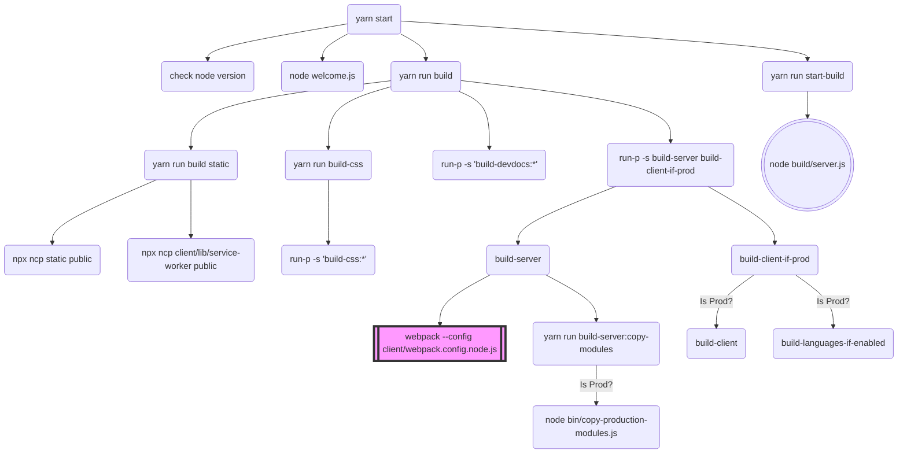

# Commands executed with `yarn start`

This is a graphical representation of the commands being executed when you run `yarn start`:

```mermaid
graph TB
style wpc fill:#f9f,stroke:#333,stroke-width:4px


A(yarn start)-->B(check node version)
A-->C(node welcome.js)
A-->yrb(yarn run build)
A-->yrsb(yarn run start-build)
yrb-->yrbs(yarn run build static)
yrb-->yrbcss(yarn run build-css)
yrb-->H(run-p -s 'build-devdocs:*')
yrb-->I(run-p -s build-server build-client-if-prod)
yrbs-->J(npx ncp static public)
yrbs-->K( npx ncp client/lib/service-worker public)
yrbcss-->L(run-p -s 'build-css:*')
I-->bs(build-server)
I-->bcip(build-client-if-prod)
bs-->wpc[[webpack --config client/webpack.config.node.js]]
bs-->bscp(yarn run build-server:copy-modules)
bscp--Is Prod?-->M(node bin/copy-production-modules.js)
bcip--Is Prod?-->N(build-client)
bcip--Is Prod?-->O(build-languages-if-enabled)
yrsb-->nbs((("node build/server.js")))

```
