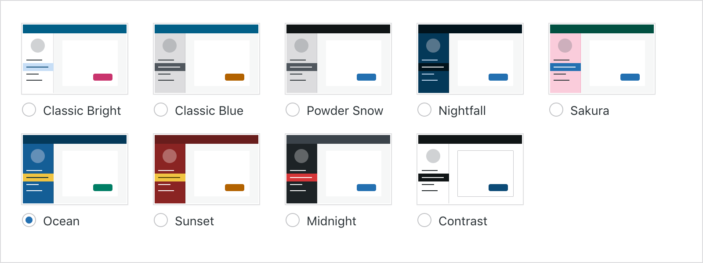

# Calypso Color Schemes

This package contains a number of CSS custom properties used in Calypso.



## Installation

```sh
yarn add @automattic/calypso-color-schemes
```

## Usage

Add this packages CSS from `dist/calypso-color-schemes.css` in order to access the CSS custom
properties.
