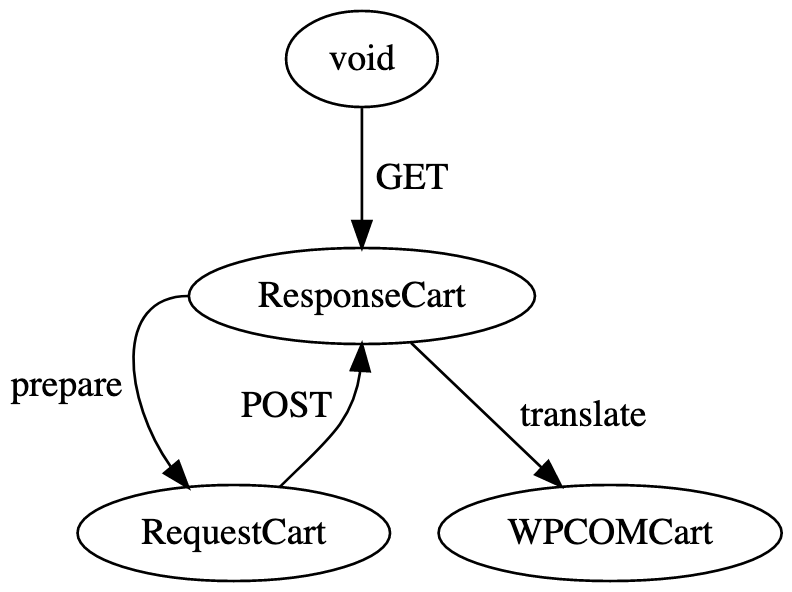

composite-checkout-wpcom
========================

This package consists of helper functions and types for integrating the generic `composite-checkout` package with wordpress.com.

Cart Types
----------

There are several slightly different kinds of "cart" floating around in checkout, from which we call out the following three:

1. `RequestCart`: This is the cart format required by POST requests to the shopping cart endpoint.
2. `ResponseCart`: This is the cart format returned by both GET and POST requests to the shopping cart endpoint. (Note that in practice GET and POST return slightly different things, but for our purposes we can treat them the same.)
3. `WPCOMCart`: This is the cart format used in the checkout components. It is essentially the format used by the `composite-checkout` package with some extra WPCOM specific metadata added on.

Inside the checkout component users are able to edit the state of their shopping cart -- and it's important to be very clear about exactly what is being edited.

This package exposes a custom hook, in `hooks/use-shopping-cart.ts`, which handles all cart edits. This hook carries a cached `ResponseCart` as state representing the most recent response from the backend. This state is converted to a `WPCOMCart` on the fly, and after being edited is converted to a `RequestCart` for revalidation on the fly. **Only** the cached `ResponseCart` is directly manipulated by edit operations; it is crucial to maintain this invariant so that we don't end up with sync issues.

