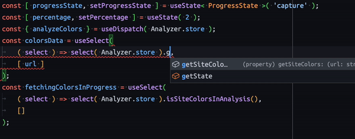

# Calypso Data Stores

This package contains a collection of `@wordpress/data`-based stores that can be used to fetch data from various WordPress.com REST API endpoints.

It is meant to be helpful for projects developed inside the [Calypso monorepo](https://github.com/Automattic/wp-calypso) that don't want to use Calypso's (monolithic) Redux state tree.

## Usage

To use stores from the package, import and register the relevant store to obtain its key:

```tsx
import React from 'react';
import { useSelect } from '@wordpress/data';
import { Verticals } from '@automattic/data-stores';

const VERTICALS_STORE = Verticals.register();

export const VerticalSelect = (): React.FunctionComponent<  > => {
	const verticals = useSelect( ( select ) => select( VERTICALS_STORE ).getVerticals() );

	return (
		<ul>
			{ verticals.map( ( vertical ) => (
				<li key={ vertical.vertical_id }>{ vertical.vertical_name }</li>
			) ) }
		</ul>
	);
};
```

## A note about store `register` functions

Stores are not registered in their module code. Instead, they expose `register` functions. This is an important technical consideration to avoid [side effects and allow tree-shaking](https://webpack.js.org/guides/tree-shaking/#mark-the-file-as-side-effect-free).

When implementing a store, registration on evaluation should be avoided. Please, follow the pattern of exporting a `register` function.

When an application needs to use a store that should be configured, it may be helpful to expose that store from a wrapper module:

```ts
// vertical-store.ts
import { DomainSuggestions } from '@automattic/data-stores';
export const DOMAIN_SUGGESTIONS_STORE = DomainSuggestions.register( {
	/* …my application configuration… */
} );
// elsewhere…
import { DOMAIN_SUGGESTIONS_STORE } from './vertical-store';
select( DOMAIN_SUGGESTIONS_STORE ).getCategories();
```

## Types

The stores in this package are written in TypeScript, and type definitions are generated as part of the build process. Furthermore, we're injecting type information for available selectors and actions into the `@wordpress/data` module, which means that you'll get handy autocomplete suggestions, if you're writing your project in TypeScript and you've enabled your editor's TypeScript feature or plugin.


