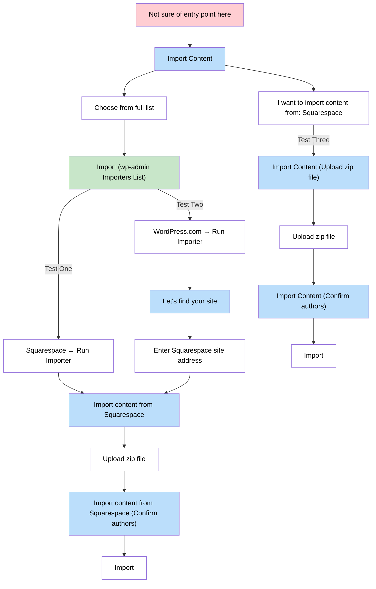

## Flowcharts

Flowcharts are a good way of representing what an e2e test covers in the system.

MermaidJS is a good resource for generating flowcharts using plain text source formatting, which is viewable on GitHub and in VSCode using an extension.

An example is:

