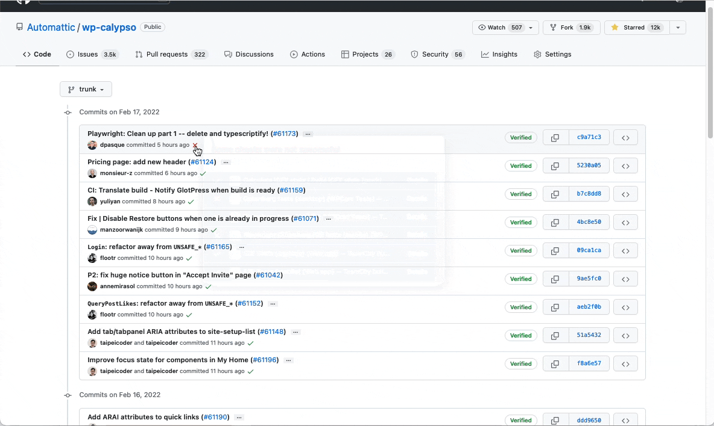

<a href="./tests_local.md"><-- Running tests on your machine</a> 

<a href="./../README.md">Top</a>

<a href="./writing_tests.md">Writing Tests --></a> 

  

# Running tests on CI

<!-- TOC -->

- [Running tests on CI](#running-tests-on-ci)
  - [Feature branch](#feature-branch)
  - [Trunk](#trunk)
  - [Manually run a build configuration](#manually-run-a-build-configuration)
  - [Scheduled build configurations](#scheduled-build-configurations)

<!-- /TOC -->

 

> :lock: Unfortunately, access to TeamCity is available only to Automatticians at this time. OSS Citizens (including Trialmatticians), please request an Automattician to execute the required e2e tests in the PR.

## Feature branch

Anytime a new branch is pushed to GitHub it also becomes available in TeamCity.

| Build configuration name | Automatically triggered? |
| ------------------------ | ------------------------ |
| E2E Tests (mobile)       | Yes                      |
| E2E Tests (desktop)      | Yes                      |
| Pre-Release Tests        | No                       |

Viewing various build configurations for a given branch.

## Trunk

The main branch - `trunk` - behaves differently from feature branches. Changes to `trunk` can only occur once a PR is approved and merged.

The Pre-Release E2E tests are connected directly to the Calypso Deploy page and various Slack channels. If the Pre-Release E2E tests pass, the change(s) can then be deployed to production.

| Build configuration name | Automatically triggered? |
| ------------------------ | ------------------------ |
| E2E Tests (mobile)       | No                       |
| E2E Tests (desktop)      | No                       |
| Pre-Release Tests        | Yes                      |

## Manually run a build configuration

Note the `Run` button beside every available build configuration. This is the quickest way to manually trigger a new run.

Some reasons to trigger a manual run:

- unexpected or flaky test suite (reminder: report flakey tests using [this form](https://github.com/Automattic/wp-calypso/issues/new?assignees=&labels=Flaky+e2e&template=flaky-e2e-spec-report.yml&title=Flaky+E2E%3A+))
- additional data point for confidence.
- target build configuration is not triggered automatically.

On manually triggering a build, a build is added to the queue and will execute once its turn arrives.

## Scheduled build configurations

In addition to build configurations that are automatically triggered based on branch workflow, there exists build configurations that run on a regular schedule though **only on `trunk`**!

| Build configuration name            | Frequency  |
| ----------------------------------- | ---------- |
| WPCOM/Gutenberg E2E Tests (mobile)  | once a day |
| WPCOM/Gutenberg E2E Tests (desktop) | once a day |
| Quarantined E2E                     | once a day |
