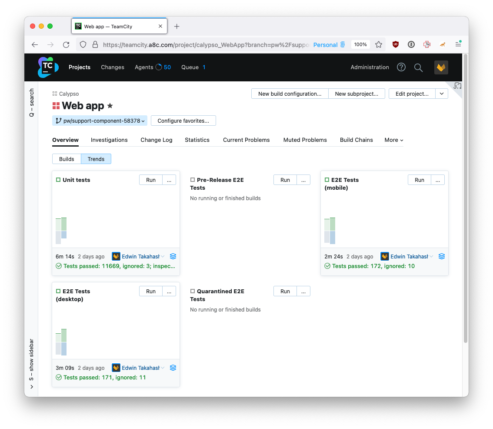
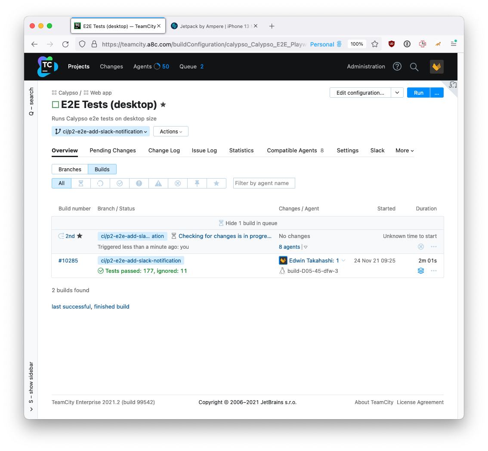

# Running tests on CI

<!-- TOC -->

- [Running tests on CI](#running-tests-on-ci)
  - [Feature branch](#feature-branch)
  - [Trunk](#trunk)
  - [Manually trigger a run](#manually-trigger-a-run)

<!-- /TOC -->

 

> :lock: Unfortunately, access to TeamCity is available only to Automatticians at this time. OSS Citizens (including Trialmatticians), please request an Automattician to execute the required e2e tests in the PR.

## Feature branch

Anytime a new branch is pushed to GitHub it also becomes available in TeamCity. Build are automatically triggered for every commit for the following build configurations:

- Unit tests
- E2E Tests (mobile)
- E2E Tests (desktop)
- Code style

Some build configurations are not triggered automatically, but are available to be run if manually triggered:

- Quarantined E2E
- Pre-Release E2E

## Trunk

The main branch - `trunk` - is treated similarly to feature branches with the notable difference that `Pre-Release E2E` is triggered automatically. This occurs for every merge into `trunk`.

The Pre-Release E2E tests are connected directly to the Calypso Deploy page (internal) and various Slack channels. If the Pre-Release E2E tests pass, the change(s) can then be deployed to production.

## Manually trigger a run

Note the `Run` button beside every available build configuration. This is the quickest way to manually trigger a new run.

Some reasons to trigger a manual run:

- flakey tests (reminder: report flakey tests using [this form](https://github.com/Automattic/wp-calypso/issues/new?assignees=&labels=Flaky+e2e&template=flaky-e2e-spec-report.yml&title=Flaky+E2E%3A+))
- additional data point
- failed auto-trigger.

On manually triggering a build, a build is added to the queue and will execute once its turn arrives.

