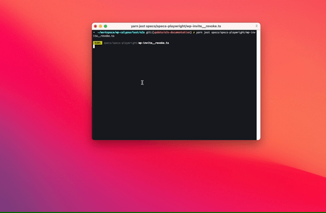

# Running tests on your machine

<!-- TOC -->

- [Running tests on your machine](#running-tests-on-your-machine)
  - [Prerequisites](#prerequisites)
  - [Running tests](#running-tests)
    - [Individual spec files](#individual-spec-files)
    - [Group](#group)
  - [Advanced techniques](#advanced-techniques)
    - [Save authentication cookies](#save-authentication-cookies)
    - [Target local webapp](#target-local-webapp)
    - [Debug mode](#debug-mode)

<!-- /TOC -->

## Prerequisites

Prior to running any tests, transpile TypeScript code:

```
yarn workspace @automattic/calypso-e2e build
```

Alternatively, open a separate Terminal window and run:

```
yarn workspace @automattic/calypso-e2e build --watch
```

## Running tests

### Individual spec file(s)

Specify the file(s) directly:

```
yarn jest specs/specs-playwright/wp-support__popover.ts specs/specs-playwright/wp-support__home.ts
```

### Group

We use [jest-runner-groups](https://github.com/eugene-manuilov/jest-runner-groups) to group and run suites of specs.

Use the `--group` arg to provide a suite to test `Jest`. For example, to run all the tests that are run for every commit:

```
yarn jest --group=calypso-pr
```

## Advanced techniques

### Save authentication cookies

Implemented in [#58082](https://github.com/Automattic/wp-calypso/pull/58082), this allows the storage of authenticated cookies of the users listed [here](https://github.com/Automattic/wp-calypso/blob/trunk/test/e2e/lib/jest/globalSetup.ts#L33). These cookies are valid for up to a day.

**Enable**

```
export SAVE_AUTH_COOKIES=true
```

or

```
SAVE_AUTH_COOKIES=true yarn jest ...
```

The result should look like this:



**Disable**

```
unset SAVE_AUTH_COOKIES
```

or

```
SAVE_AUTH_COOKIES=false
```

### Target local webapp

Local development environment refers to a locally served instance of the `wp-calypso` frontend.

1. ensure required [dependencies](setup.md#software-environment#steps) are installed.

2. change the `calypsoBaseURL` value in `test/e2e/config/default.json` to `http://calypso.localhost:3000`.

   Alternatively: create a new local-<name>.json under `test/e2e/config` and set the `calypsoBaseURL` value to `http://calypso.localhost:3000`.

3. start the webapp:

```shell
yarn start
```

4. once webapp is started, open `http://calypso.localhost:3000` in your browser.

5. ensure requests to `http://calypso.localhost:3000` are registering in your local instance.

The local environment is now ready for testing. When a test is run, it will hit the local development server instead of the WordPress.com staging environment.

### Debug mode

Refer to the [Debugging](debugging.md) page for techniques on running a test in debug mode.

#0## Notes on TypeScript

Because Jest, the test runner, is already to configured to use Babel as a transpiler before executing scripts, there is no extra pre-build command you need to execute to run TypeScript test scripts. You can simply just have Jest run all the scripts in the `specs/specs-playwright` directory, and it will automatically take care of running both `.js` and `.ts` files.

Please note: [Babel does not do type-checking as it runs](https://jestjs.io/docs/getting-started#using-typescript), so if you want to do a specific type-check for your test scripts, you can use the local `tsconfig.json` by running `yarn tsc --project ./tsconfig.json`. We run this as part of the Playwright CI script, so all types will be checked before tests are run on TeamCity.

The local `tsconfig.json` also adds global Jest typings, so you do **not** need to explicitly import `describe` or `it` into your TypeScript testing files.
