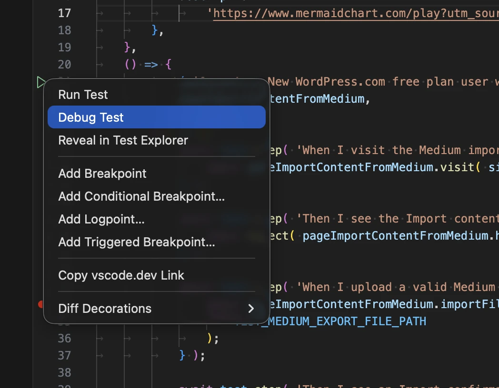
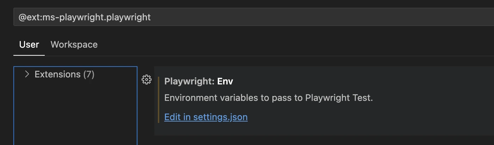

[← Documentation index](./overview.md)

# Running tests on your machine

<!-- TOC -->

- [Running tests on your machine](#running-tests-on-your-machine)
  - [Prerequisites](#prerequisites)
  - [Running tests](#running-tests)
    - [Individual spec files](#individual-spec-files)
    - [Test tag](#test-tag)
    - [Suite scripts](#suite-scripts)
    - [Running from the Playwright VSCode extension](#running-from-the-playwright-vscode-extension)
  - [Advanced techniques](#advanced-techniques)
    - [Save authentication cookies](#save-authentication-cookies)
    - [Use the mobile viewport](#use-the-mobile-viewport)
    - [Target a different environment](#target-a-different-environment)
    - [Debug mode](#debug-mode)
      - [Notes on TypeScript](#notes-on-typescript)

<!-- /TOC -->

## Prerequisites

Prior to running any tests, transpile TypeScript code:

```bash
# If within test/e2e directory
yarn build

# If at repo root
yarn workspace wp-e2e-tests build
```

Alternatively, open a separate Terminal window:

```bash
# If within test/e2e directory
yarn build --watch

# If at repo root
yarn workspace wp-e2e-tests build --watch
```

## Running tests

### Individual spec file(s)

Specify the file(s) directly:

```bash
yarn test:pw -- <path_to_file_1> <path_to_file_2> --reporter=list
```

`--reporter=list` keeps a failing run from opening the HTML report and holding the terminal. Drop it, then `yarn playwright show-report`, when you want that report. Every command below takes it too.

### Test tag

Specs are grouped by the tags declared on their `test.describe` block. Use Playwright's
`--grep` to run a suite. For example, to run all specs that are executed on CI for a commit:

```bash
# If within test/e2e directory
yarn test:pw:calypso-pr --reporter=list

# If at repo root
yarn workspace wp-e2e-tests test:pw:calypso-pr --reporter=list
```

See the [list of tags](tests_ci.md#featuretest-tags).

### Suite scripts

Each of these greps a tag, or pins a viewport, so you do not have to:

| Script                     | Runs                                                          |
| -------------------------- | ------------------------------------------------------------- |
| `test:pw:desktop`          | the desktop viewport only.                                    |
| `test:pw:mobile`           | the mobile viewport only.                                     |
| `test:pw:calypso-pr`       | the specs run for every commit to a feature branch.           |
| `test:pw:calypso-release`  | the specs run for every PR merged into `trunk`.               |
| `test:pw:dashboard-pr`     | the Dashboard specs run for every commit to a feature branch. |
| `test:pw:authentication`   | login, 2FA and security key specs.                            |
| `test:pw:a8c-for-agencies` | the A8C for Agencies specs.                                   |
| `test:pw:i18n`             | the internationalization specs.                               |
| `test:pw:p2`               | the P2 specs.                                                 |

### Running from the Playwright VSCode extension

Once you have installed the [Playwright VSCode extension](./setup.md), you can run and debug
specs from the extension pane or from the spec file itself.



To set environment variables for the extension, such as `CALYPSO_BASE_URL`:

1. "View -> Extensions"
2. Locate Playwright and click "Settings"
3. Locate `Playwright: Env` and "Edit in settings.json"
4. Add or update any environment variables under `playwright.env`:

```
"playwright.env": {
  "CALYPSO_BASE_URL": "http://calypso.localhost:3000"
},
```



## Advanced techniques

### Save authentication cookies

Authentication cookies are cached per account under `COOKIES_PATH`. The first worker that needs an account logs in while holding that account’s lock and writes the cookie file; other workers wait for the lock, then reuse that file. There is no separate priming step.

### Use the mobile viewport

By default, tests run against the `desktop` viewport size, approximately 1920x1080. Two projects run specs:

- `desktop`: Desktop Chrome HiDPI, the `desktop` viewport.
- `mobile`: Pixel 7, the `mobile` viewport. Specs tagged `@desktop-only` are skipped.

To launch a spec with mobile viewport:

```bash
yarn test:pw:mobile <path_to_spec> --reporter=list
```

### Target a different environment

By default these tests target <http://calypso.localhost:3000>. To target a webapp running in a different environment:

1. determine the base URL to use for the appropriate environment.

   - for staging/production webapp: `https://wordpress.com`
   - for wpcalypso webapp: `https://wpcalypso.wordpress.com`
   - for horizon webapp: `https://horizon.wordpress.com`

2. set the `CALYPSO_BASE_URL` environment variable:

   a. set the variable to persist in the shell: `export CALYPSO_BASE_URL=<url>`

   b. set the variable for the command only: `CALYPSO_BASE_URL=<url> yarn test:pw -- <test_path> --reporter=list`


<sup><center>Example: webapp running on localhost.</center></sup>

### Debug mode

Refer to the [Debugging](debugging.md) page for techniques on running a test in debug mode.

#### Notes on TypeScript

Playwright Test transpiles TypeScript specs itself, so there is no extra pre-build command needed to run them.

It does not type-check as it runs. To type-check the specs, run `yarn tsc --noEmit --project test/e2e/tsconfig.json` from the repo root.
